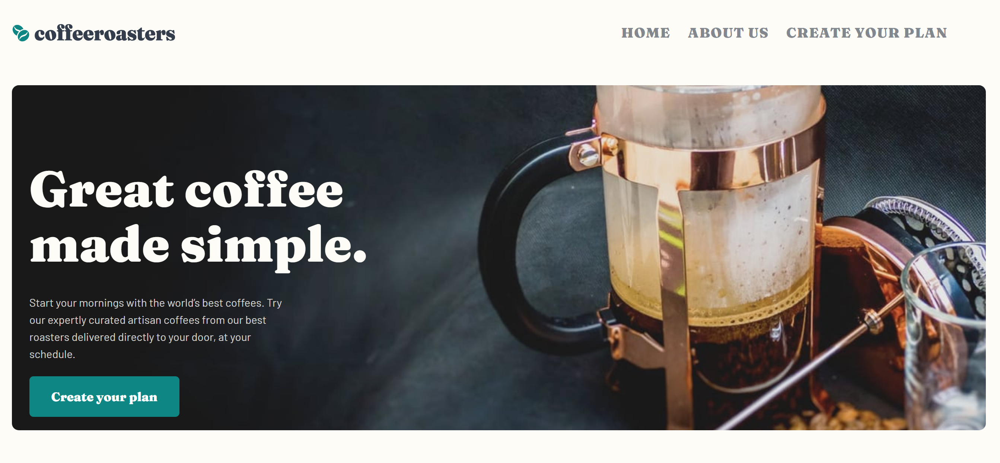
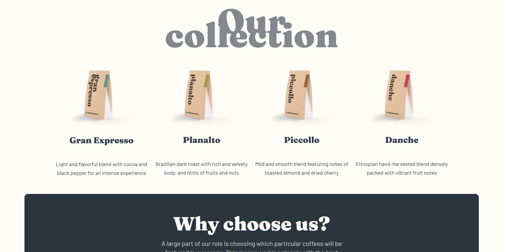
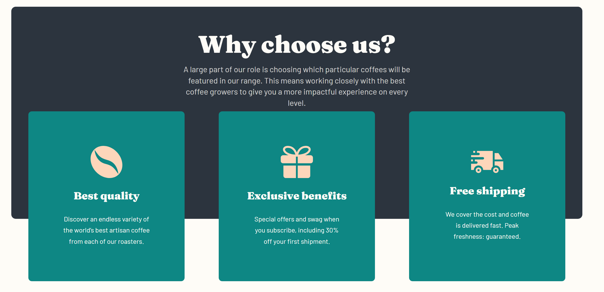

# CoffeeShop Landing Page

Welcome to the CoffeeShop Landing Page project! ☕️ This project is a responsive and visually appealing website landing page for a coffee shop, designed using HTML, CSS, JavaScript, and SCSS.





## Table of Contents

- [Project Overview](#project-overview)
- [Features](#features)
- [Technologies Used](#technologies-used)
- [Installation](#installation)
- [Usage](#usage)
- [Contributing](#contributing)
- [License](#license)
- [Acknowledgements](#acknowledgements)

## Project Overview

The CoffeeShop Landing Page is a modern and stylish web page created to showcase the best of what a coffee shop has to offer. It includes sections for the menu, special offers, customer testimonials, and contact information. The goal of this project is to provide an engaging user experience for coffee enthusiasts and potential customers.

## Features

- Responsive design that works on all devices
- Interactive menu section with images and descriptions
- Testimonials carousel
- Contact form
- Smooth scrolling and animations
- Easy navigation

## Technologies Used

- **HTML**: Markup language for structuring the web page
- **CSS**: Styling the web page
- **JavaScript**: Adding interactivity and dynamic content
- **SCSS**: CSS preprocessor for writing more maintainable and scalable styles

## Installation

To get a local copy up and running, follow these simple steps:

1. **Clone the repository:**
   ```bash
   git clone https://github.com/ArmanBhatia0100/CoffeeShop-landing-page.git
   ```
2. **Navigate to the project directory:**
   ```bash
   cd CoffeeShop-landing-page
   ```
3. **Install dependencies:**
   ```bash
   npm install
   ```

## Usage

To start the project locally, use the following command:
```bash
npm start
```

This will start a local server and open the CoffeeShop Landing Page in your default web browser.

## Contributing

Contributions are welcome! If you have any suggestions for improvements or find any issues, please feel free to open an issue or submit a pull request.

1. Fork the project
2. Create your feature branch (`git checkout -b feature/AmazingFeature`)
3. Commit your changes (`git commit -m 'Add some AmazingFeature'`)
4. Push to the branch (`git push origin feature/AmazingFeature`)
5. Open a pull request

## License

Distributed under the MIT License. See `LICENSE` for more information.
Feel free to customize this README to fit your specific project details. Happy coding! 🎉
